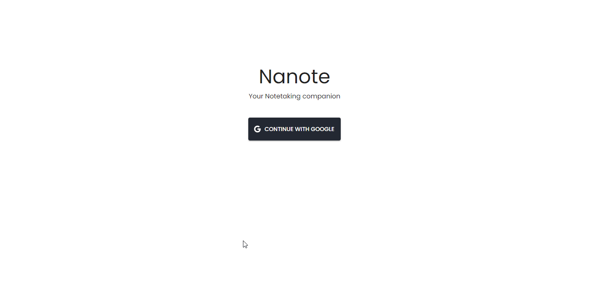

# Nanote

### A simple note-taking web app

## Table of Contents

- [Overview](#overview)
  - [The Challenge](#the-challenge)
  - [Desktop View](#desktop-view)
  - [Links](#links)
- [My Process](#my-process)
  - [Built With](#built-with)
  - [What I Learned](#what-i-learned)
- [Useful Resources](#useful-resources)
- [Author](#author)

## Overview

### The Challenge

- CRUD based note-taking web app.
- Responsive UI, implemented Google authentication.
- User can create notes based on category with created and modified dates, can edit and delete notes. Also add notes to favourite.

## Desktop View

### Links

- [Live Preview](https://nanote-moeen.web.app/login)
- [Server-side Repo](https://github.com/moeen-mahmud/nanote-server)

## My Process

### Built With

- **Front End**: Material UI, ReactJS
- **Back End**: NodeJS, ExpressJS
- **Technologies**: MongoDB, Firebase Authentication, Firebase Hosting, Heroku.

### What I learned

- The core concepts of Material UI.
- How to work with date-time with MomentJS.
- The mechanism of favorite button and sort the notes by category using API calls.

## Useful Resources

- [React Documentation](https://reactjs.org/)
- [Material UI Documentation](https://mui.com/)

## Author

- GitHub - [moeen-mahmud](https://github.com/moeen-mahmud)
- Twitter - [moeen_mahmud](https://twitter.com/moeen_mahmud)
